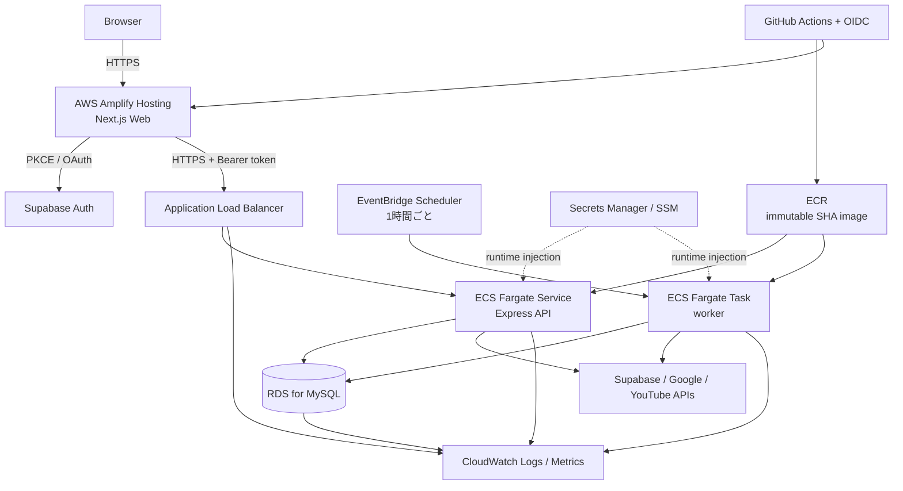

# デプロイアーキテクチャ

## ステータス

- 決定日: 2026-08-04（RDS minorは2026-08-05更新）
- 対象: 個人利用から招待制 beta、将来の小規模一般公開
- 採用案: AWS 統一構成（Web のみ AWS Amplify Hosting、API/worker/DB は AWS のマネージドサービス）

STEP 4でAWS CDK、production image、CI/CDまで実装した。2026-08-04時点では`synth`とローカル検証だけが完了し、AWS resource、契約、domain、外部service設定はまだ作成・変更していない。

## 現行アプリケーションの実行要件

| 対象   | 現行要件                                                                                                                      | デプロイ上の結論                                                               |
| ------ | ----------------------------------------------------------------------------------------------------------------------------- | ------------------------------------------------------------------------------ |
| Web    | Next.js 15 App Router、SSR、`middleware.ts`、Route Handler の `/auth/callback`、`next build` / `next start`                   | 静的ホスティングのみでは不可。Next.js SSR と middleware を実行できる基盤が必要 |
| API    | Express、Node.js 22.23.1、既定 port 4000、`GET /health`、Bearer 認証、Prisma/MySQL、外部 API 通信、同期を待つ HTTP リクエスト | 長めのリクエストを許容し、常駐プロセスをそのまま動かせるサービスが必要         |
| worker | `pnpm sync:scheduled` で起動する一回実行型 CLI、正常系は exit 0、失敗は exit 1、MySQL lease/fencing 使用                      | 1時間ごとの短命なコンテナタスクに適する                                        |
| DB     | Prisma 6、MySQL、外部キー、transaction、lease/fencing、migration                                                              | MySQL 8.4 系の独立した managed DB が必要。SQLite へは変更しない                |

Web の公開設定は `NEXT_PUBLIC_API_URL`、`NEXT_PUBLIC_DEMO_MODE=false`、`NEXT_PUBLIC_SUPABASE_URL`、`NEXT_PUBLIC_SUPABASE_PUBLISHABLE_KEY`。API/worker の秘密設定は [環境戦略](../operations/environment-strategy.md) に分類する。

APIは`GET /health`をprocess liveness、`GET /ready`をDB readinessとして分離した。`TRUST_PROXY_HOPS=1`、設定可能なgraceful shutdown、API/workerのPrisma切断も実装済みである。ALB target checkは外部依存を呼ばない`/health`、deploy後のsmokeと運用監視は`/ready`も使う。

## 推奨構成

production と staging は同じ論理構成を別stackとして使う。初期は1 AWS account/region内でも、VPC、ECS cluster、ECR repository、ALB、ECS service、IAM role、security group、log group、Secrets、RDSを環境ごとに分離する。固定費は増えるが、誤接続・誤削除・security group共有を避ける方を優先した。GitHub OIDC providerだけはaccount内で共有し、staging stackが作成、production stackが同じprovider ARNを参照する。

### コンポーネント責務

| コンポーネント | staging                                           | production                                     | 責務                                                 |
| -------------- | ------------------------------------------------- | ---------------------------------------------- | ---------------------------------------------------- |
| Web            | Amplify app（source: main、environment: staging） | 独立 Amplify app（source: main）               | Next.js SSR、middleware、CSP、Supabase PKCE callback |
| API            | Fargate service、desired count 1                  | Fargate service、beta は desired count 1       | Express API、認証、手動同期、Google credential 管理  |
| worker         | Scheduler → Fargate RunTask                       | 独立 Scheduler → Fargate RunTask               | 1時間ごとの同期。一回実行後に終了                    |
| MySQL          | RDS for MySQL 8.4.10、Single-AZ、独立 instance    | RDS for MySQL 8.4.10、Single-AZ、独立 instance | 永続データ、lease、fencing、migration                |
| image          | staging ECRのimmutable digest                     | 同じmanifestをproduction ECRへ昇格             | API と worker を同一 image、別 command で実行        |

Web はコンテナ化しない。API と worker は同じ source、Prisma Client、migration を含む同一 imageを使い、APIは`node api/dist/server.js`、workerは`node worker/dist/index.js`をcommandにする。migrationは同じimageの一回限りECS taskから`api/node_modules/.bin/prisma migrate deploy --schema=/opt/oshi-schedule/prisma/schema.prisma`を実行する。RDS managed secretのusername/passwordはentrypointがprocess memory上でTLS必須の`DATABASE_URL`へ構成し、imageやCloudFormationへ完全URLを保存しない。

## ネットワークと通信

- region は利用者と開発者に近い `ap-northeast-1`（東京）を暫定採用する。
- ALB は public subnet、RDS は private subnet に置き public access を無効にする。
- 小規模段階の ECS task は public subnet と public IPv4 を使い、outbound は security group で許可する。これにより NAT Gateway の固定費を避ける。task への inbound は ALB security group から API port のみに限定し、worker は inbound rule を持たない。
- DB security group は環境ごとの ECS security group から MySQL port のみ許可する。staging task から production DB、production task から staging DB へは接続できない。
- RDS 接続は AWS CA bundle を検証する TLS を必須とし、`DATABASE_URL` の connection pool は task 数に応じた小さい `connection_limit` にする。
- APIのALB idle timeoutは300秒、target deregistration delayは60秒を初期値とする。アプリ側timeoutより長くし、実測p95に基づき再調整する。

## TLS、HSTS、ドメイン

暫定ドメイン構成は次のとおり。`example.com` は未購入の registrable domain に置換する。

| 環境       | Web                           | API                               | アプリ callback                             |
| ---------- | ----------------------------- | --------------------------------- | ------------------------------------------- |
| staging    | `https://staging.example.com` | `https://api-staging.example.com` | `https://staging.example.com/auth/callback` |
| production | `https://app.example.com`     | `https://api.example.com`         | `https://app.example.com/auth/callback`     |

Web は Amplify/CloudFront、API は ALB と ACM certificate で TLS を終端し、HTTP は HTTPS へ redirect する。production は HSTS `max-age=31536000` を Web と ALB response header で付ける。staging と localhost には HSTS を付けない。`includeSubDomains` と `preload` は、registrable domain 配下の全ホストがHTTPSのみで運用され、少なくとも数か月安定した後に別判断する。

Supabase Site URL/Redirect URL、Google OAuth client、`WEB_ORIGIN` は環境ごとの完全一致 URL を使う。Google provider の redirect URI は各 Supabase project の `https://<project-ref>.supabase.co/auth/v1/callback` であり、アプリ callback とは別である。Web/API 間は cookie を共有せず Supabase access token を Bearer で渡すため、同一親ドメインへの依存はない。

## rate limit

- 招待制 beta は API desired count 1で開始し、既存のメモリ内 IP rate limit とDB上のユーザー/購読単位 cooldownを併用する。
- ALBだけを唯一のproxyとして`TRUST_PROXY_HOPS=1`をSSMから注入し、ALBの`X-Forwarded-For`はappend modeを使う。booleanの無条件`true`は使わない。
- 認証後の制限はIPだけに頼らず、user ID単位を優先する。共有NATやIPv6の利用者を不当に巻き込まないためである。
- desired countを2以上にする前、またはメモリ内制限の不一致を観測した時点で、ElastiCache for Valkey/Redisの共有storeへ移す。小規模では固定費と運用対象を増やすため導入しない。

## scaling と強化条件

| 条件                                                         | 変更                                                                 |
| ------------------------------------------------------------ | -------------------------------------------------------------------- |
| API CPU または memory が15分以上70%超、p95 latencyが目標超過 | task sizeを上げる。次に desired count 2へ水平scale                   |
| desired countを2以上にする                                   | shared rate-limit storeを先に導入し、DB connection上限を再計算       |
| 招待制betaを越えて可用性要求が上がる                         | production APIを2 AZ/2 tasks、RDSをMulti-AZに変更                    |
| DB CPU/connection/storageが継続して70%超                     | RDS class/storageを拡張し、slow queryとindexを確認                   |
| チーム化、監査/請求/権限分離が必要                           | productionを別AWS accountへ移す                                      |
| workerが45分を超える、チャンネル数が100を超える              | channel単位job queue/分割taskを設計し、実行頻度とYouTube quotaを調整 |

## 採用・不採用判断

- **Amplify Hostingを採用**: Next.js 15 SSR、App Router、middleware、Node.js 22をサポートし、個人開発でWeb専用コンテナを運用せずに済む。現行アプリはAmplify非対応のEdge API routes、streaming、on-demand ISRを使っていない。
- **ECS FargateをAPIに採用**: Express/Prismaを大きく変更せず、120秒を超える可能性がある同期リクエスト、任意command、graceful shutdown、将来の水平scaleを扱える。App Runnerはrequest total timeoutが120秒なので不採用。Lambdaは処理分割を伴うため不採用。
- **Scheduler + Fargate Taskをworkerに採用**: 一回実行型CLIとexit codeをそのまま使える。常駐workerとLambdaへの移植は不要。
- **RDS for MySQLを採用**: Prisma migration、外部キー、transaction、lease/fencingをMySQLのまま使える。Aurora Serverless v2は小規模で構成と費用の利点が明確でなく、auto-pause復帰もある。MySQL互換PaaSは互換性・backup・network境界の検証対象が増えるため初期採用しない。
- **MySQL 8.4 minorを固定**: 初回構築はAWS/CDKが対応する8.4.10をstaging/production共通で使う。standard support終了日前にAWSの現行minor、東京region、Prisma、CDK定数を再確認し、integration testと`cdk diff`を経て更新する。
- VercelはNext.jsとの適合性が最も高いが、商用Proのseat固定費とAWSとの運用分散を避けるため採用しない。Cloud Run案はscale-to-zeroで安価になり得るが、Cloud SQLとの接続pool、cold start、複数cloudの監視と権限管理を優先課題にしないため採用しない。

詳細は[費用見積](../operations/cost-estimate.md)と[Web配置ADR](../decisions/0001-host-web-on-amplify.md)を参照する。

## STEP 4実装

- `Dockerfile`はNode.js 22.23.1/pnpm 9.15.9のmulti-stage build、非root、RDS CA bundle、API/worker/migration共用である。
- `infra/`はTypeScript AWS CDKで、NATなしのpublic compute/isolated RDS、TLS未設定時の503固定応答、environment別removal policyを定義する。
- Schedulerは既定disabled、1時間ごと、retry 2回、最大event age 1時間、SQS DLQを持つ。ECS STOPPEDかつexit code非0をEventBridge ruleでSNSへ通知する。
- Amplify App/branchはCDK管理するが、GitHub接続とdomain verificationは管理画面で人が完了する。
- 実構築手順は[staging構築](../operations/staging-setup.md)を正とする。

## 関連文書

- [環境分離とSecret](../operations/environment-strategy.md)
- [CI/CDとdeployment](../operations/deployment.md)
- [監視](../operations/monitoring.md)
- [バックアップと復旧](../operations/backup-and-recovery.md)
- [費用見積](../operations/cost-estimate.md)
