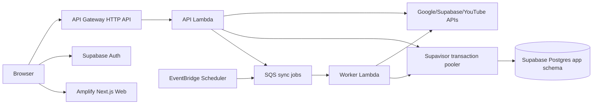

# production serverless低コスト移行設計

## Status

- Decision: **Supabase Free + AWS Lambda + S3 7日backupを正式採用する**
- Documented: 2026-09-01
- Implementation: 実装完了、staging cutover前
- Safety: 現行production full deployは中止を維持する。AWS/Supabase write、DB migration、deployはこの文書の承認に含めない。

この決定を実装した時点で、ADR 0002（ECS API）、0003（Fargate Worker）、0004（RDS MySQL）はproductionについて置き換える。stagingの現行構成には直ちに適用しない。

## 結論

推奨production構成は次のとおり。

- AmplifyとSQS/DLQ/Schedulerの機能契約、API custom domain、Route 53、ACM、Secrets Manager/SSMを維持する。productionにまだ実体がないresourceは新serverless templateで作成する。
- API GatewayのintegrationをVPC Link/Cloud Map/ECSからLambda proxyへ変更する。
- Fargate WorkerをSQS event sourceとSchedulerから起動するLambdaへ変更する。
- application DBをproduction Supabase Authと同一projectのPostgresへ置き、RDS、VPC、VPC Link、Cloud Map、ECS、public IPv4をproduction templateから除く。
- Prismaは維持するが、MySQLからPostgreSQLへ一度だけ移行する。
- productionはSupabase **Free**を使い、`app` schemaの日次dumpを暗号化S3へ7日保持する。Supabase Authは独自dump対象外で、Free projectのpause可能性を運用上の制約として受け入れる。

## 現行productionとの差分

| 責務               | 現行のdeploy予定          | 推奨構成                              | 主な効果                   |
| ------------------ | ------------------------- | ------------------------------------- | -------------------------- |
| Web                | Amplify                   | Amplifyを維持                         | 変更なし                   |
| API edge           | HTTP API → VPC Link       | HTTP API → Lambda proxy               | VPC Link/Cloud Mapを除去   |
| API compute        | ECS Fargate 1 task        | Lambda、provisioned concurrency 0     | idle compute費を除去       |
| application DB     | RDS MySQL Single-AZ       | Supabase Postgres Free                | AuthとDBのprojectを統合    |
| manual/initial job | SQS → Pipe → Fargate task | SQS → Lambda event source             | Pipe/ECS task起動を除去    |
| scheduled job      | Scheduler → Fargate task  | Scheduler → SQS → Worker Lambda       | 同じ1時間周期を維持        |
| migration          | one-off ECS task          | protected GitHub Actions job          | migration専用computeを除去 |
| rate limit         | 1 processのmemory store   | API Gateway throttle + DynamoDB store | Lambda横断で一貫させる     |
| outbound           | task public IPv4          | Lambdaのpublic AWS network            | VPC/NAT/public IPv4不要    |

production full stackは未deployで、現時点のAWS production resourceはECR bootstrap、ACM、Secrets/SSM等に限られる。したがってRDS/ECS/VPCのdata migrationや削除はproductionでは発生しない。production Supabase projectに既存application tableがないことは、実装時のread-only preflightで確認する。

## Express APIのLambda化

### 最小変更

1. `createApp(env, container)`と既存route/middlewareを維持する。
2. `server.ts`はlocal/ECS互換entry pointとして残し、API Gateway payload v2をExpressへ渡すLambda handlerを追加する。実装候補は保守されているExpress用adapter（`@codegenie/serverless-express`等）で、独自HTTP変換は作らない。
3. env、Prisma client、JWKS cache、Google/YouTube gateway、Secret取得結果はhandler外で初期化し、warm invocationで再利用する。API handler終了ごとの`$disconnect()`は禁止する。
4. API Lambdaはx86_64、512 MiB、timeout 29秒、reserved concurrencyを設定せずaccount unreserved poolを使う。HTTP APIの50 rps / 100 burst throttleとDynamoDBの共有rate limitを維持し、Prisma engine packagingを安定させてからARM64を別最適化として評価する。
5. API Gateway custom domain `api.oshi-schedule.com`、ACM、Route 53 Alias、CORS origin、request ID、安全なaccess logを維持する。

### Lambda化でそのままでは維持できない点

- `express-rate-limit`のmemory storeは実行環境ごとに分裂する。ADR 0007のrevisit条件に該当するため、API Gatewayの50 rps/100 burstに加え、source IPまたは認証user keyの15分windowをDynamoDB on-demand tableで共有する。単にmemory middlewareを残して「100回/15分」を保証した扱いにはしない。
- SIGTERM前提のgraceful HTTP server shutdownはLambda handlerには適用しない。local `server.ts`だけで維持する。
- `/ready`はSupavisor経由の軽量`SELECT 1`を実行し、DB障害時503を返す。`/health`はDBへ接続しない。
- API Gatewayの29秒上限は現行と同じである。同期は引き続き202受付とpollingで、YouTube/Calendar処理をrequest内へ戻さない。

## Worker、SQS、Scheduler

### Targeted worker

- Standard SQSとsync DLQ、message bodyの`syncRunId`、DB上のatomic claim、heartbeat、stale recoveryを維持する。
- Lambda event source mappingはbatch size 1、`ReportBatchItemFailures`、maximum concurrency 2で開始する。API/Workerのreserved concurrencyは使わない。account quotaが小さい間も、APIが一時的にunreserved poolを使い切った場合はWorkerをthrottleしてSQS retryに戻るため、同期jobは失われない。
- Lambda handlerは既存`runTargeted(syncRunId)`を呼ぶ。retryable infrastructure failureはthrow/failed itemとしてSQS retryへ返し、terminal business resultは正常ackする。現行CLIのexit codeだけではLambda retryを制御できないため明示変換する。
- deliveryは引き続きat-least-onceである。SyncRun claim、active-run dedupe、SyncLease fencing、deterministic Calendar event IDを削らない。
- timeoutは最大14分、queue visibility timeoutは少なくとも90分、redriveは3回を初期値とする。実測p95が10分を超えたら、Lambda timeoutを延ばすのではなくchannel/subscription単位fan-outへ移る。

### Scheduled worker

- EventBridge Scheduler `rate(1 hour)`は`{kind:"scheduled"}`を同じsync SQSへ送る。Worker LambdaはSQS payloadを検証して、targeted runまたは`runPendingManual()`後の`runScheduled()`を実行する。SchedulerがWorkerを直接invokeしないため、manual/initial/periodicの全経路がSQSのretry/DLQ/最大2並列に統一される。
- `runPendingManual()`のorphan回収後に`runScheduled()`を実行する現行順序、maximum event age 1時間、retry 2、Scheduler DLQを維持する。
- Lambdaの最大実行時間は15分で、現行Fargate workerの期待上限45分より短い。stagingデータで14分以内をcontract testし、duration 10分超をalarmにすることをproduction enableの必須条件とする。
- 14分に収まらない場合の確定fallbackは、Schedulerをenumerator Lambdaへ変更し、channel/subscriptionごとのSQS messageへfan-outすること。Fargateへ戻すことを通常fallbackにしない。

AWSはSQS event sourceを少なくとも一度処理するため、idempotencyが必要である。またpartial batch responseを使うと成功messageの不要な再処理を避けられる。詳細は[AWS LambdaとSQS](https://docs.aws.amazon.com/lambda/latest/dg/with-sqs.html)と[partial batch failure](https://docs.aws.amazon.com/lambda/latest/dg/services-sqs-errorhandling.html)を参照する。

## Prisma MySQLからPostgreSQLへの変更

### Schema

- datasource providerを`postgresql`へ変更する。
- app tableはData APIに公開しない専用`app` schemaへ配置する。`public`へ作成しない。`anon`/`authenticated`/`service_role`へapp schema privilegeを付与しない。
- `@db.DateTime(3)`はUTC semanticsを明示する`@db.Timestamptz(3)`へ変更する。`VarChar`、`Text`、`Char`、enum、foreign key、unique/indexはPostgreSQLで維持できる。
- Prisma model/enum名とCUID primary keyは維持できる。index名はPostgreSQLの63-byte制限を確認する。
- Supabase `auth.users`とのforeign keyは追加しない。現行どおり`supabaseUserId`を境界IDとして保持し、Auth削除とapplication deletion tombstoneの再開性を維持する。

Supabaseの`public` schemaはData APIへ露出し得るため、専用非公開schemaを使う。露出schemaのtableにはRLSとgrantの両方が必要であることは[Supabase Data API security](https://supabase.com/docs/guides/api/securing-your-api)に明記されている。

### MySQL固有SQL

現行`PrismaStore`には、汎用Prisma query以外にlease、quota、claim、行lock用のraw SQLがある。主な置換は次のとおり。

| MySQL                                | PostgreSQL                                         |
| ------------------------------------ | -------------------------------------------------- |
| `UTC_TIMESTAMP(3)`                   | `CURRENT_TIMESTAMP` / `clock_timestamp()`          |
| `TIMESTAMPADD(MICROSECOND, ...)`     | `CURRENT_TIMESTAMP + n * INTERVAL '1 millisecond'` |
| `INSERT IGNORE`                      | `INSERT ... ON CONFLICT DO NOTHING`                |
| backtick identifier                  | double-quoted identifier                           |
| `FOR UPDATE`                         | 維持                                               |
| `Serializable` transaction           | 維持し、SQLSTATE `40001` retryを追加               |
| conditional `UPDATE ... WHERE` claim | PostgreSQLでもrow count 1を所有権判定に使用        |

特に`acquireSyncLease`は、expired rowのconditional updateとinsert-on-conflictを同一transactionで行い、`ownerToken + version` fencingを維持する。quota予約もupsert後の条件付きincrementを同一transactionで行う。DB時刻を基準にし、Lambda host clockだけでlease所有権を判断しない。

### Migration履歴

既存migrationはMySQLの`ENUM`、`DATETIME(3)`、`MODIFY`、`INSERT IGNORE`、backtick、collationを含み、そのままPostgreSQLへ適用できない。production RDSは未作成なので、次の方式を採る。

1. 既存MySQL migrationを監査用archiveとして固定する。
2. PostgreSQL用の新baseline migrationを生成し、`app` schema、role/grant、全constraint/indexをSQL reviewする。
3. local PostgreSQLで空DBへの`migrate deploy`とschema diff 0を確認する。
4. stagingを先にSupabase Postgresへ移し、必要ならMySQL staging dataを専用ETLでIDを維持してcopyする。件数、foreign key、unique、timestamp、暗号文/key IDだけを検証し、token本文を出力しない。
5. productionは空の`app` schemaへbaselineを1回適用する。Supabase Auth schemaをreset/dropしない。

MySQLとPostgreSQLを一つのmigration directoryで恒久的にdual-runしない。移行期間だけ明示的なschema/migration pathを分け、staging cutover完了後にPostgreSQLを唯一のsource of truthとする。

## Supabase接続と権限

### Runtime

- Lambdaの`DATABASE_URL`はSupavisor shared poolerのtransaction mode（port 6543、TLS必須）を使う。これはSupabaseがserverless向けとする接続方式である。
- Prisma 6.19.3はSupavisor用に`pgbouncer=true`を使い、`connection_limit=1`から開始する。PrismaClientはhandler外で1 instanceだけ生成し、invocationごとにdisconnectしない。
- Worker concurrencyはSQS event sourceの最大2、各LambdaのPrisma connection limitは1に制限する。APIはHTTP API throttleとDynamoDB共有rate limitを使い、pooler/client connectionの上限を構成testにする。account quotaが10の間も、最大2本のWorker DB connectionと短命API invocationの合計で成立し、Workerの一時throttleはSQS retryで回復する。
- runtime role `oshi_runtime`は`app` schemaの必要なDMLだけを持つ。migration owner、`postgres`、Supabase `service_role` DB roleをruntime connectionに使わない。

Supabaseはserverlessにtransaction poolerを推奨し、transaction modeではprepared statement制約がある。[Supabase接続方式](https://supabase.com/docs/guides/database/connecting-to-postgres)と[Prisma/Supavisor設定](https://docs.prisma.io/docs/orm/prisma-client/setup-and-configuration/databases-connections/pgbouncer)を契約元とする。

### Migration

- migrationはLambdaで自動実行せず、GitHub production Environmentのmanual approval付きjobで`prisma migrate deploy`を1回だけ実行する。
- `DIRECT_URL`はDDL owner `oshi_migrator`用とし、runtime secretと分離する。direct IPv6接続を第一候補にし、CI runnerのnetworkが対応しない場合はSupavisor session mode（port 5432）を事前検証した上で使う。transaction modeでPrisma Migrateを実行しない。
- workflowはAWS OIDCで必要なSecretだけを取得し、maskを有効にし、DB URLをartifact/logへ残さない。migration前後のmigration IDとschema statusだけをrelease recordへ残す。

### Secret

既存4 Secret（Supabase service-role、Google client secret、YouTube API key、token encryption keys）と`allowed-emails` SecureStringは再利用できる。追加でruntime pooled DB URLとmigration direct/session DB URLを別Secretとして作る。公開Supabase URL、Google client ID、Web/API originはLambda environmentの非秘密値とする。

## Security、OAuth、Calendarへの影響

- Supabase JWTのJWKS検証、audience/issuer、allowed emails、service-roleによるAuth account削除は変更しない。
- Google refresh tokenは既存AES-GCM ciphertext/key IDをそのままPostgreSQLへ移し、token encryption keysをrotateせず再利用する。平文化migrationは禁止する。
- `calendar.app.created`、実grant検証、refresh token再同意、専用Calendar create/get/delete、event CRUD、deterministic ID、managed hashは変更しない。
- API/Worker LambdaはGoogle/YouTube/Supabase public endpointへVPCなしで接続する。security group/NATは不要になるが、egress IP allowlistを将来要求する場合は別network設計が必要になる。
- SecretはLambda environmentへCloudFormationで平文展開せず、function roleにexact ARNのreadだけを与え、initialization時にSecrets Manager/SSMから取得してwarm cacheする。log sanitizerとtoken非表示testを維持する。
- Supabase application tableは非公開`app` schemaに置く。Data APIをアプリDBアクセスに使わず、publishable keyからapp tableへ到達できないdeny testを追加する。

## Supabase Freeの採用条件

正式採用はFreeである。低activity projectのpause、自動backup/PITRなし、platform logの短い保持、community supportという制約を受け入れる。その代わり、非公開`app` schemaだけを毎日PostgreSQL 17 custom-formatでdumpし、S3 lifecycleで7日保持する。最大RPOは24時間であり、Supabase Authはこのdumpに含まれない。backup jobをpause回避のkeep-aliveには使わず、pause時は運営者が復旧する。

RPO 24時間、Authの独自backup不在、またはpauseが許容できなくなった場合は、一般公開を止めず場当たり的に回避せず、Supabase Pro/PITRまたは別の継続backupを先に設計・承認する。根拠は[Supabase pricing](https://supabase.com/pricing)、[project pausing](https://supabase.com/docs/guides/platform/free-project-pausing)、[database backups](https://supabase.com/docs/guides/platform/backups)である。

## 月額見込み

前提は東京region、低traffic beta、API 10万request/月未満、manual sync 1,000件/月未満、Worker平均1〜3分、Amplify build数回、CloudWatch log 5 GB未満、税・domain年額・Google API超過なし。料金はquoteではなくplanning rangeである。

| Service                | Free tierを保守的に除いた月額目安 | 備考                                                      |
| ---------------------- | --------------------------------: | --------------------------------------------------------- |
| Supabase Free          |                             $0.00 | app schemaは別途S3へ日次backup                             |
| Amplify Hosting/SSR    |                      $0.50〜$3.00 | build、storage、transfer、SSR従量                         |
| API Gateway HTTP API   |                      $0.00〜$0.20 | 約$1/million request帯                                    |
| Lambda API/Worker      |                      $0.00〜$1.00 | free allowance内なら0。provisioned concurrencyなし        |
| SQS + Scheduler        |                      $0.00〜$0.10 | SQS 1M、Scheduler 14M invocation/月のfree allowance内想定 |
| Secrets Manager        |                           約$2.40 | 既存4 + DB URL 2、$0.40/secret/月                         |
| Route 53 + DNS query   |                      $0.50〜$0.70 | hosted zone $0.50/月                                      |
| CloudWatch alarms/logs |                      $0.50〜$2.00 | log量とalarm数による                                      |
| ECR                    |                      $0.00〜$0.20 | rollback期間だけ既存imageを保持                           |
| S3 backup              |                      $0.00〜$0.10 | 7世代、低容量のapp schema                                  |
| **合計**               |                   **約$4〜10/月** | data transfer上振れを除く                                 |

AWSの根拠は[Lambda pricing](https://aws.amazon.com/lambda/pricing/)、[HTTP API pricing](https://aws.amazon.com/api-gateway/pricing/)、[SQS pricing](https://aws.amazon.com/sqs/pricing/)、[EventBridge pricing](https://aws.amazon.com/eventbridge/pricing/)、[Secrets Manager pricing](https://aws.amazon.com/secrets-manager/pricing/)、[Amplify pricing](https://aws.amazon.com/amplify/pricing/)、[Route 53 pricing](https://aws.amazon.com/route53/pricing/)を使う。

## 既存AWS resourceの扱い

| Resource                                   | 判断                                                                     | 実施時期          |
| ------------------------------------------ | ------------------------------------------------------------------------ | ----------------- |
| Route 53 hosted zone/records               | 再利用。API Aliasのtargetだけ新HTTP APIへ                                | serverless deploy |
| API ACM certificate                        | 再利用                                                                   | serverless deploy |
| Amplify App/Branch/Domain                  | production実体は未作成。現行の設定契約を新規作成時に維持                 | Web工程           |
| application Secret 4件                     | ARNと値を再利用                                                          | Lambda作成時      |
| allowed-emails SecureString                | 再利用                                                                   | API Lambda作成時  |
| production ECR/repository/image            | rollback用に30日retain、その後別承認で削除候補                           | serverless受入後  |
| RDS/ECS/VPC/VPC Link/Cloud Map/public IPv4 | productionでは未作成。新templateから除外                                 | 実装時            |
| SQS/sync DLQ/Scheduler DLQ                 | production実体は未作成。名称、retention、redrive契約を引き継いで新規作成 | serverless deploy |
| EventBridge Pipe/Pipe role                 | Lambda event sourceへ置換し不要                                          | serverless deploy |
| ECS task roles/definitions/service/cluster | 作成しない                                                               | 実装時            |
| RDS generated secret/snapshot policy       | 作成しない                                                               | 実装時            |
| SNS/Budget/alarms/log groups               | Lambda向けに再設計して維持                                               | serverless deploy |

既存production stackはECR bootstrapを所有しているため、同じstackをserverless templateへ更新し、ECRを一時retainする。手動resource作成や別stackへの無計画なownership移動は行わない。

## 改修規模と主要リスク

見積は1人開発で約15〜25 engineer-days（3〜5週間）。外部review、staging受入、Google verification待ちは含まない。

| Workstream                          |   規模 | Risk                                         |
| ----------------------------------- | -----: | -------------------------------------------- |
| PostgreSQL schema/raw SQL/migration | 5〜8日 | High: lease/quota/claimの並行性              |
| API Lambda adapter/rate limit       | 2〜4日 | Medium: proxy/cold start/distributed counter |
| Worker/SQS/Scheduler Lambda         | 3〜5日 | High: 15分上限、retry/ack semantics          |
| CDK/Secrets/monitoring              | 2〜4日 | Medium                                       |
| staging migration/acceptance/docs   | 3〜6日 | High: data parityとexternal Calendar副作用   |

最大リスクはPostgreSQLのatomicity差、scheduled workerの15分上限、Supavisor/Prisma connection、rate-limit分散、backup RPO変更である。OAuth/Calendar scope自体は変更しない。

## Test方針

1. local PostgreSQL integrationで全migration、schema diff 0、foreign key/index/enum/timestampを検証する。
2. leaseの同時acquire/renew/release/fencing、quota予約、manual run enqueue/claim/stale reclaimを実PostgreSQL並行testで固定する。
3. API Gateway payload v2から全route、CORS、request ID、JWT、32 KiB body、error mappingをcontract testする。
4. SQS duplicate delivery、partial failure、visibility/redrive、terminal/retryable error、Scheduler retry/DLQをhandler testする。
5. Lambda concurrency上限とSupavisor connection count、cold/warm start、29秒API timeout、14分worker timeoutをstaging load/smokeで検証する。
6. publishable key/anon/authenticatedから`app` schemaへ到達できないdeny testを行う。
7. OAuth、credential暗号、`calendar.app.created`、Calendar create/get/delete/event CRUD、account deletion、retentionを既存受入と同じ匿名化基準で再実施する。
8. production rollout前にbackup restore rehearsalを行い、daily backup前提の実RPOを記録する。

## 実装ロードマップとrollback

### Phase 0: owner decision（完了）

- Supabase Free、S3 daily backup 7日、PITRなし、RPO最大24時間を承認済み。
- Lambda scheduled runが14分を超えた場合にfan-outへ進むことを承認する。
- serverless production CDK diffの許容resourceを確定する。現行ECS/RDS full deployは引き続き禁止する。

### Phase 1: database compatibility

- PostgreSQL schema/baseline、private `app` schema、runtime/migrator roleを実装する。
- raw SQLとintegration testをPostgreSQLへ移す。
- staging data ETL/dry-runとrollback exportを作る。

Rollback: staging MySQLを変更せず新Postgresへcopyし、previewは現行stagingのdomain/resourceを変更しない。edge cutover前は現行staging imageへ戻せる。dual-writeは行わない。

### Phase 2: Lambda runtime

- API handler、Worker handlers、DynamoDB rate limit、SQS event source、Scheduler target、Secret loader、Lambda monitoringを実装する。
- ZIP artifactにPrisma client/engine/CAを含め、container/ECR依存を外す。

Rollback: API Gateway integrationをversioned Lambda alias間で戻す。DB schemaはadditive migrationを使い、旧PostgreSQL-compatible Lambdaへ戻せる状態を維持する。

### Phase 3: staging cutover

- 既存`oshi-schedule-staging` stackとは別の`oshi-schedule-staging-serverless` preview stackへ、Supabase Postgres migration/ETL後のAPI/Workerを出す。previewは既存Amplify、custom domain、ECR、RDS/ECS/Pipeを参照・変更しない。
- previewのexecute-api URLでLambda API/Workerを受入し、必要なCORS originだけ既存staging Webを許可する。
- edge cutoverは受入後の別工程とする。既存stackから旧resourceを自動deleteするCDK updateを行わず、resource importまたは明示的なownership移管diffをreviewしてから、domain/Amplify/APIを切り替える。
- manual/initial/scheduled Sync、duplicate、scope、Calendar、deletion、DLQ、duration、connectionを確認する。
- 旧RDS/ECSはrollback期間中sleep/disabledで保持し、受入後に別承認で削除する。

### Phase 4: production deploy

- production `app` schemaが空であることをread-only確認し、baseline migrationをprotected CIで1回適用する。
- serverless CDK diffを再取得し、RDS/ECS/VPC CREATE 0、Lambda/SQS/API/monitoringの期待差分だけでdeployする。
- Lambda aliasを0%から切り替え、Web/API/OAuth/Sync/Calendar/backup受入を完了する。

productionはまだ利用開始前なので、cutover前rollbackは「deployしない」ことで完結する。利用開始後にMySQLへ戻すrollbackはdata変換を必要とするため採用しない。PostgreSQLを維持したままLambda versionまたは一時ECS runtimeへ戻す。

### Phase 5: cleanup

- 30日rollback window後に、未使用ECR/image、旧staging RDS/ECS/VPC、obsolete Secret/SSM/IAMをresourceごとの別承認で削除する。
- Terms/Privacy、backup runbook、cost budgetをSupabase Free + S3 backupの実態へ更新する。

## Deploy前のhard gate

- Supabase Freeとbackup/RPO方針のowner承認（完了）
- PostgreSQL concurrency integration test green
- scheduled worker p95 < 10分、max < 14分
- runtime/migrator DB role分離、app schema非公開deny test green
- Lambda concurrency/connection budget検証
- SQS retry/DLQ/idempotency contract green
- serverless full diffでRDS/ECS/VPC/VPC Link/Cloud Map/Public IPv4 CREATE 0
- monthly budgetを20 USDで監視
- Terms/Privacyとbackup runbookのSupabase表現更新
- PrivacyでSupabase platformとCloudWatch application logを区別
- Google/Supabase production外部設定とHigh 2の残作業完了
