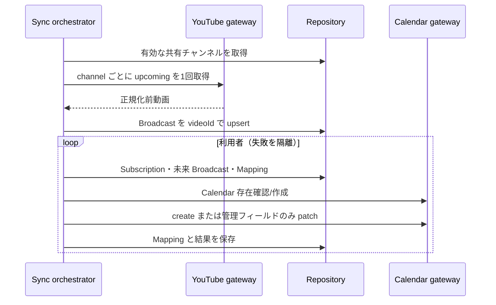

# 同期設計

## パイプライン

## YouTube 取得

`channels.list(forHandle)` で handle を安定 ID に解決する。予定取得は第三者チャンネルで利用可能な `search.list(channelId,type=video,eventType=upcoming,maxResults=50)` をページングし、ID を50件ずつ `videos.list(part=snippet,contentDetails,liveStreamingDetails,status)` で詳細化する。`publishedAfter/Before` は公開日時であり予定開始の境界ではないため、詳細化後に `scheduledStartTime <= now+30d` を適用する。quota値は変更され得るため固定値を設計根拠にせず、Google Cloud Consoleの割当量と実測を監視する。公式資料: [channels.list](https://developers.google.com/youtube/v3/docs/channels/list)、[search.list](https://developers.google.com/youtube/v3/docs/search/list)、[videos resource](https://developers.google.com/youtube/v3/docs/videos)。

`liveStreamingDetails` がある動画だけを対象とする。第三者向け Data API には耐久的なプレミア判定 field がないため、duration から推測せず種別を `UNKNOWN` として保存・表示する。将来、公式に保証された判定根拠を追加できた場合だけ `LIVE` / `PREMIERE` を確定する。通常予約動画は `eventType=upcoming` の新規検索対象に含めない。

upcoming 検索に加え、DB に保存済みで直近 30 日以内かつ未完了の video ID を最大 50 件ずつ `videos.list` で再取得する。`actualStartTime` / `actualEndTime` と `liveBroadcastContent` から UPCOMING/LIVE/COMPLETED を正規化し、実終了が得られたら仮終了を置換する。詳細応答から消えた ID は CANCELLED と断定せず `UNAVAILABLE` とし、履歴と Calendar event を保持する。検索は `nextPageToken` を最大 500 件まで辿る。

## 差分・冪等性

- Broadcast は YouTube video ID、Mapping は `(userId,broadcastId)` が一意。
- Calendar の `extendedProperties.private` に `managedBy=oshi-schedule` と `youtubeVideoId` を入れる。
- Mapping の event ID は hash 一致時も存在確認し、404/410 なら新 event を作成して mapping を更新する。Calendar 自体が 404/410 なら再作成し、各 mapping を新 Calendar 上で reconcile する。
- summary/description/start/end/status/extendedProperties の hash が同じで event も存在する場合だけ更新しない。patch で管理項目だけ変更する。
- 新規 event は `(userId,youtubeVideoId)` から Google 仕様に適合する決定的 ID を作る。POST 成功後に mapping 保存が失敗しても再試行時の 409 を PATCH へ収束させる。削除済み既存 event は新しい ID で作り mapping を差し替える。
- 終了不明は Live +60 分、Premiere +30 分で `endTimeProvisional=true`。実績終了取得後に解除して patch。
- 明示的 `rejected` 等はタイトルへ `【中止】` を付ける。検索欠落だけでは削除・中止にせず既存データを保持する。`missingCount` は将来の複数回欠落判定用に予約しており、明確な判定根拠を追加するまでは自動削除に使わない。

## 実行制御

自動同期は原則 60 分、手動は subscription 単位 5 分の DB 保存時刻を使う。API と worker をまたぐ二重実行は `SyncLease` の owner 付き 15 分 lease で防ぎ、外部反映ループ中に延長する。crash 後は期限切れ lease を取得し直す。YouTube の前回取得が 5 分以内なら DB cache だけを Calendar へ反映する。

各実行は `SyncRun`、各 subscription は `SyncTargetResult` に RUNNING から最終状態を保存する。定期実行は 1 利用者の失敗を隔離し、全体を SUCCESS/PARTIAL_FAILED/FAILED へ集約する。24時間超のRUNNINGは次の定期実行でFAILEDへ回収し、完了履歴は90日保持する。subscription の `lastCalendarSyncAt` は成功時だけ更新し、error code は安全な定数だけを保存する。外部呼び出しは 10 秒 timeout とし、恒久失効と一時障害を区別する。OAuth token endpointの429/5xx/network failureは指数的delayを入れて最大3回だけ試行し、`invalid_grant`だけを再認証要求にする。

登録解除は所有者条件で subscription を取得し、`scheduledStartAt` が現在より未来の mapping だけを処理する。Google DELETE 成功または 404/410 の後に mapping を削除し、全件完了後に subscription を削除する。一部失敗時は subscription と未処理 mapping が残るため再実行でき、過去 event、他 User の mapping、共有 Channel/Broadcast は保持する。
