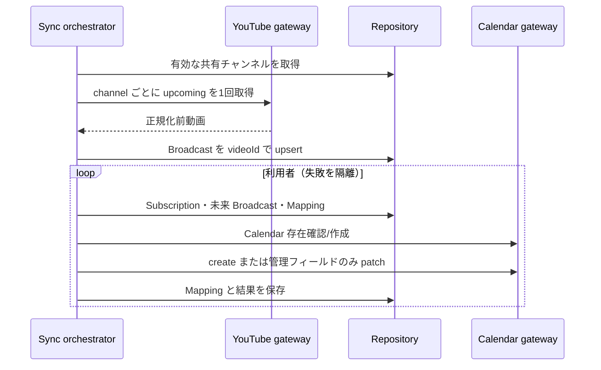

# 同期設計

## パイプライン

## YouTube 取得

`channels.list(forHandle)` で handle を安定 ID に解決する。予定取得は第三者チャンネルで利用可能な `search.list(channelId,type=video,eventType=upcoming,maxResults=50)` を使い、ID を50件ずつ `videos.list(part=snippet,contentDetails,liveStreamingDetails,status)` で詳細化する。`publishedAfter/Before` は公開日時であり予定開始の境界ではないため、詳細化後に `scheduledStartTime <= now+30d` を適用する。ページ数は `YOUTUBE_MAX_SEARCH_PAGES`（既定1）で制限する。

`channels.list(part=contentDetails)` からuploads playlistを取得し、`playlistItems.list` と `videos.list` を組み合わせる方式も検討した。これらは各1 unitで公開済みuploadの走査には安価だが、uploadsの順序はupload/publishに基づき、将来の `eventType=upcoming` を指定できない。第三者チャンネルの30日以内の公開予定を、有限ページで取りこぼさない保証にならないため置換しない。スクレイピングや所有者権限が必要なLive Streaming APIも使わない。公式資料: [quota calculator](https://developers.google.com/youtube/v3/determine_quota_cost)、[channels.list](https://developers.google.com/youtube/v3/docs/channels/list)、[playlistItems.list](https://developers.google.com/youtube/v3/docs/playlistItems/list)、[search.list](https://developers.google.com/youtube/v3/docs/search/list)、[videos.list](https://developers.google.com/youtube/v3/docs/videos/list)。

`liveStreamingDetails` がある動画だけを対象とする。第三者向け Data API には耐久的なプレミア判定 field がないため、duration から推測せず種別を `UNKNOWN` として保存・表示する。将来、公式に保証された判定根拠を追加できた場合だけ `LIVE` / `PREMIERE` を確定する。通常予約動画は `eventType=upcoming` の新規検索対象に含めない。

upcoming 検索に加え、DB に保存済みで直近 `YOUTUBE_TRACKING_WINDOW_DAYS`（既定30日）以内かつ未完了の video ID を、チャンネルごとに `YOUTUBE_MAX_TRACKED_BROADCASTS_PER_CHANNEL`（既定50件）へ制限し、新しい予定開始順で `videos.list` へ50件ずつまとめて再取得する。IDは重複排除し、COMPLETED/CANCELLEDは追跡しない。`actualStartTime` / `actualEndTime` と `liveBroadcastContent` から UPCOMING/LIVE/COMPLETED を正規化し、実終了が得られたら仮終了を置換する。詳細応答から消えた ID は CANCELLED と断定せず `UNAVAILABLE` とし、履歴と既存 Calendar event を保持する。quota延期時は詳細応答がないためUNAVAILABLEへ変更しない。

### quota unitと日次予算

2026-06-01更新の公式仕様では、`search.list` は独立bucketで1 requestあたり1 unit、`channels.list`、`playlistItems.list`、`videos.list` は一般bucketで各1 unitである。無効・失敗requestも最低1 unit、追加ページとretryもrequestごとに消費し、日次quotaはPacific Timeの午前0時にresetされる。既定割当は変更され得るため、Cloud Consoleを正として監視する。現行の標準割当はsearch bucketが100 unit/day、その他endpointの合計が10,000 unit/dayである。

アプリ内上限は一般 `YOUTUBE_DAILY_QUOTA_BUDGET=8000`、search `YOUTUBE_DAILY_SEARCH_QUOTA_BUDGET=80` とする。`YouTubeQuotaUsage` に設定timezoneの日付、bucket、使用済み/予約中unitを保存し、request直前に条件付きUPDATEでatomic予約する。request開始後は成功・失敗を問わず予約を使用済みへ移す。process crashで予約が残った場合は過剰実行より延期を選ぶ。ログはmethod/bucket/予約/使用/残量/runIdだけを記録し、API keyやresponse bodyは記録しない。

`P=maxSearchPages`、`T=maxTracked`、`B=ceil(T/50)`とすると、MVPの3チャンネル×24回の通常最大はSEARCH `72P`、GENERAL `72(P+B)`、最大attemptを含む理論上限はそれぞれに`maxAttempts`を乗じる。既定P=1/T=50/B=1では通常SEARCH 72・GENERAL 144、3attemptで216・432 unit/dayである。searchはアプリ上限80で打ち切って延期する。自動同期用にsearch 72、一般432 unitを保護し、手動処理は保護枠を侵食できない。設定変更時はこの式をコードから再計算し、GENERAL reserveまたは通常SEARCH reserveが不足すれば起動を拒否する。

quota不足は `YOUTUBE_QUOTA_DEFERRED` と次回reset時刻へ変換する。YouTube requestは行わず、保存済みDBデータのCalendar同期を続け、target/subscription履歴をDEFERREDとして保存する。取得・DB更新・Calendar同期のphaseは別々に記録し、同期run全体は他targetを継続する。

## 差分・冪等性

- Broadcast は YouTube video ID、Mapping は `(userId,broadcastId)` が一意。
- Calendar の `extendedProperties.private` に `managedBy=oshi-schedule` と `youtubeVideoId` を入れる。
- Mapping の event ID は hash 一致時も存在確認し、404/410 なら新 event を作成して mapping を更新する。Calendar 自体が 404/410 なら再作成し、各 mapping を新 Calendar 上で reconcile する。
- summary/description/start/end/status/extendedProperties の hash が同じで event も存在する場合だけ更新しない。patch で管理項目だけ変更する。
- 新規 event は `(userId,youtubeVideoId)` から Google 仕様に適合する決定的 ID を作る。POST 成功後に mapping 保存が失敗しても再試行時の 409 を PATCH へ収束させる。削除済み既存 event は新しい ID で作り mapping を差し替える。
- 終了不明は Live +60 分、Premiere +30 分で `endTimeProvisional=true`。実績終了取得後に解除して patch。
- 明示的 `rejected` 等はタイトルへ `【中止】` を付ける。検索欠落だけでは削除・中止にせず既存データを保持する。`missingCount` は将来の複数回欠落判定用に予約しており、明確な判定根拠を追加するまでは自動削除に使わない。
- mappingのないCalendar新規作成は、予定開始が未来のUPCOMINGまたはactualEndAtのないLIVEだけに限定する。過去UPCOMING、COMPLETED/UNAVAILABLE/CANCELLED/UNKNOWN、実終了確定済みは作成せず、既存mappingがある場合だけ状態・実終了時刻をpatchする。仮終了時刻を過ぎてもstatusがLIVEなら新規作成・更新対象である。
- YouTube payloadに実質差分がない場合は `sourceUpdatedAt` を進めず、Calendar存在確認のfan-outを抑える。

## 実行制御

自動同期は原則 60 分、手動は subscription 単位 5 分の DB 保存時刻を使う。API と worker をまたぐ二重実行は `SyncLease` のownerと単調増加version（fencing token）で防ぐ。取得・期限比較・更新はDB時刻を使い、外部呼出しの前後でowner/versionを確認する。stale ownerの更新・解放・snapshot確定は条件付きtransactionで拒否し、crash後は期限切れを新versionで再取得する。channel lease所有者は取得開始状態を保存し、Broadcast更新と成功時刻・snapshotVersion増分を1 transactionで確定する。後続workerは新しい完了versionをbounded pollし、そのsnapshotを自分のsubscriptionへCalendar展開する。待機中に完了しなければDEFERREDでありSUCCESSにしない。各ユーザーのCalendar失敗は他ユーザーから隔離する。

各実行は `SyncRun`、各 subscription は `SyncTargetResult` に RUNNING から最終状態を保存する。定期実行は 1 利用者の失敗を隔離し、全体を SUCCESS/PARTIAL_FAILED/FAILED へ集約する。24時間超のRUNNINGは次の定期実行でFAILEDへ回収し、完了履歴は90日保持する。error logにはrunId/subscriptionId/safe error codeを含める。外部呼び出しは設定timeoutを使い、恒久失効と一時障害を区別する。OAuth token endpointの429/5xx/network failureは秒単位のexponential backoff+jitterと`Retry-After`を使って最大3回だけ試行し、`invalid_grant`だけを再認証要求にする。

登録解除は所有者条件で subscription を取得し、`scheduledStartAt` が現在より未来の mapping だけを処理する。Google DELETE 成功または 404/410 の後に mapping を削除し、全件完了後に subscription を削除する。一部失敗時は subscription と未処理 mapping が残るため再実行でき、過去 event、他 User の mapping、共有 Channel/Broadcast は保持する。
