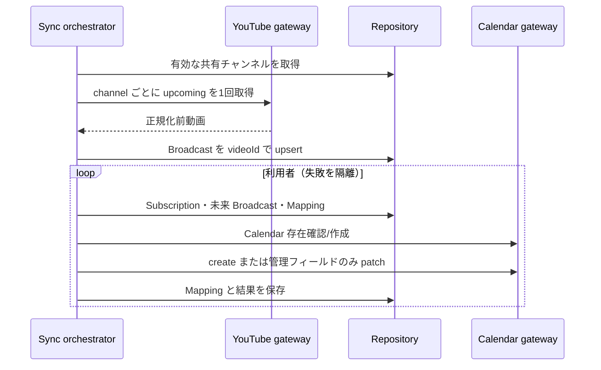

# 同期設計

## パイプライン

## YouTube 取得

`channels.list(forHandle)`（1 unit）で handle を安定 ID に解決する。予定取得は第三者チャンネルで利用可能な `search.list(channelId,type=video,eventType=upcoming,maxResults=50)`（100 units）を使い、ID をまとめて `videos.list(part=snippet,contentDetails,liveStreamingDetails,status)`（1 unit）で詳細化する。`publishedAfter/Before` は公開日時であり予定開始の境界ではないため、詳細化後に `scheduledStartTime <= now+30d` を適用する。公式資料: [channels.list](https://developers.google.com/youtube/v3/docs/channels/list)、[search.list](https://developers.google.com/youtube/v3/docs/search/list)、[videos resource](https://developers.google.com/youtube/v3/docs/videos)。

`liveStreamingDetails` がある動画を対象とし、`snippet.liveBroadcastContent` と duration/metadata から gateway が `LIVE` / `PREMIERE` を返す。Data API が第三者のプレミアを常に明示分類できないケースでは、プレミア判定不能な項目を Live として扱う暫定仕様とし、誤判定メトリクスを残す。通常予約動画は取得しない。

## 差分・冪等性

- Broadcast は YouTube video ID、Mapping は `(userId,broadcastId)` が一意。
- Calendar の `extendedProperties.private` に `managedBy=oshi-schedule` と `youtubeVideoId` を入れる。
- Mapping の event ID が 404 なら再作成。Calendar 自体が 404/410 なら再作成し未来分を再投入。
- summary/description/start/end/status/extendedProperties の hash が同じなら更新しない。patch で管理項目だけ変更する。
- 終了不明は Live +60 分、Premiere +30 分で `endTimeProvisional=true`。実績終了取得後に解除して patch。
- 明示的 `rejected` 等はタイトルへ `【中止】` を付ける。検索欠落だけでは削除・中止にせず既存データを保持する。`missingCount` は将来の複数回欠落判定用に予約しており、明確な判定根拠を追加するまでは自動削除に使わない。

## 実行制御

自動同期は原則 60 分。手動は subscription 単位 5 分の DB 保存時刻、API 全体は IP 単位 100 request/15分、use case はプロセス内ロックで二重実行を防ぐ。YouTube の前回取得が 5 分以内なら DB キャッシュのみ Calendar 反映する。外部呼び出しは 10 秒 timeout、`AppError.retryable` で 429/5xx/network と permanent error を区別する。MVP は同一実行内の自動リトライをせず、次回定期実行で再試行する。1 利用者の失敗は他へ波及させない。複数 API/worker replica 化時の分散ロックは本番公開前の課題とする。
