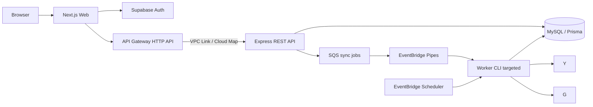

# システム概要

## 境界

- `apps/web`: 表示、Supabase PKCE、アクセストークンを付けた API 呼び出し。Google provider token は保存しない。
- `apps/api`: presentation/application/domain/infrastructure を分離した REST API。認可とユーザー操作を担当する。
- `apps/worker`: HTTPに依存しないscheduled/`SYNC_RUN_ID` targetedの入口。APIと同じapplication serviceをcomposition rootから起動する。
- `packages/shared`: API 契約、Zod schema、上限・期間などの定数。
- `prisma`: 永続モデルと migration。Channel/Broadcast は全利用者で共有する。

同期コアは port (`YouTubeGateway`, `CalendarGateway`, `Store`, `Clock`) のみに依存する。実 API と Fake は adapter として交換する。

本番・stagingの配置、network、TLS、scale方針は[デプロイアーキテクチャ](deployment-architecture.md)を参照する。

## 可用性・拡張

初回・手動同期はSyncRunをdurable jobとしてSQS/Pipesからone-off workerへ渡す。API requestは外部同期を待たない。API連打はactive run再利用、queue redeliveryはatomic claim、subscription処理の多重実行は`SyncLease` fencingで防ぐ。異常終了後はstale run/leaseを取得し直せる。AWS SDKはdispatcher adapterとIaCに閉じ、domain/applicationの同期ロジックはqueueへ依存しない。
