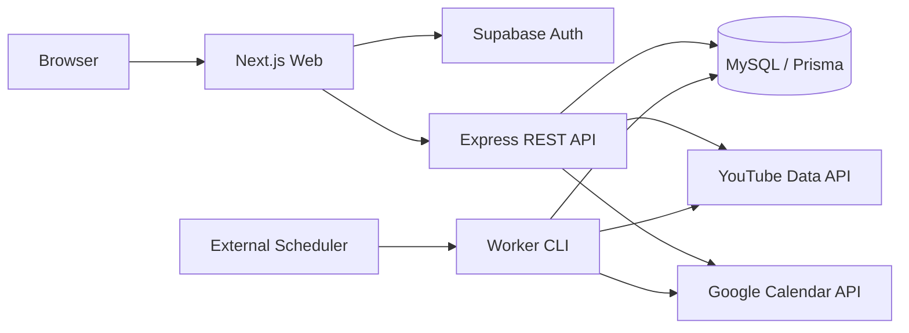

# システム概要

## 境界

- `apps/web`: 表示、Supabase PKCE、アクセストークンを付けた API 呼び出し。Google provider token は保存しない。
- `apps/api`: presentation/application/domain/infrastructure を分離した REST API。認可とユーザー操作を担当する。
- `apps/worker`: HTTP に依存しない `sync:scheduled` の入口。API と同じ application service を composition root から起動する。
- `packages/shared`: API 契約、Zod schema、上限・期間などの定数。
- `prisma`: 永続モデルと migration。Channel/Broadcast は全利用者で共有する。

同期コアは port (`YouTubeGateway`, `CalendarGateway`, `SyncRepository`, `Clock`) のみに依存する。実 API と Fake は adapter として交換する。

## 可用性・拡張

MVP は単一 API/worker プロセスを前提に、subscription 単位のプロセス内ロックと DB に保存するクールダウン時刻で多重実行を防ぐ。複数 replica 化する前に MySQL advisory lock または分散ロックを追加する。将来はジョブキューへチャンネル取得・利用者反映を分割できる。特定クラウドの SDK は domain/application に置かない。
