# CI/CD・デプロイ手順

## 原則

- GitHub ActionsとAWS OIDCを使い、長期AWS access keyを保存しない。
- API/workerは1つのimmutable ECR imageをcommit SHA tagとdigestで識別する。同一digestをstagingで検証後、productionへ昇格する。
- Webは環境ごとに独立したAmplify appへ、同じcommitをdeployする。
- migrationは環境ごとに単一の一回限りECS taskだけが実行し、API serviceやworker起動時には実行しない。
- GitHub Environmentのconcurrencyで、同じ環境のdeploy/migrationを同時実行させない。

## STEP 4で実装済みのartifact

1. Node.js 22.23.1を使うmulti-stage Dockerfile。API、worker、shared package、Prisma Client、migrationと`prisma` CLIだけをruntime imageに含める。
2. `.dockerignore`で`.env*`、Git metadata、test output、local logsを除外する。
3. API/worker/migrationのcommandを分けたECS task definition。
4. `infra/`のTypeScript AWS CDKによるstaging/production infrastructure definitionとassertion test。
5. `.github/workflows/`のCI、gated staging deploy、manual production deploy。
6. `amplify.yml`と`scripts/smoke-staging.sh`。

AWS resourceはまだ作成していない。初回は[staging構築手順](staging-setup.md)に従い、`bootstrapOnly=true`でVPC/ECRだけを作成し、imageをpushした後にfull stackをdeployする。image不在のままfull stackを先に作らない。

## Pull Request pipeline

Node.js 22.23.1、repositoryの`packageManager`に固定したpnpmを使い、次を順に実行する。

1. `pnpm install --frozen-lockfile`
2. `pnpm typecheck`
3. `pnpm lint`
4. `pnpm test`
5. Docker MySQL 8.4を起動し、disposable databaseへ全migrationを適用してintegration test
6. `prisma migrate diff`で適用後DBと`prisma/schema.prisma`の差分がないことを確認
7. production相当の非秘密sample公開設定で`pnpm build`
8. `docs/api/openapi.yaml`のparse/validationとgenerated contract test
9. `pnpm test:e2e`
10. production Docker image build（vulnerability scanはECR push前のstaging deploy workflowで必須）

E2Eは現在の規模では毎PR実行する。所要時間が継続して10分を超えた場合だけ、smoke subsetをPR、full suiteをmainへ分ける。

CIのWeb buildは`example.invalid`配下の非秘密`NEXT_PUBLIC_API_URL`/Supabase URL、テスト専用publishable文字列、`NEXT_PUBLIC_DEMO_MODE=false`を使う。E2EはWeb 3310/API 4310、fake API、`NEXT_PUBLIC_DEMO_MODE=true`へ明示的に切り替えるため、実外部serviceやローカル`.env`へ依存しない。

## main merge後のstaging pipeline

```mermaid
flowchart LR
  C[main commit] --> Q[quality checks]
  Q --> I[build image once]
  I --> S[scan image]
  S --> E[push SHA image to ECR]
  E --> M[one-off migration task]
  M --> A[deploy API service]
  A --> W[register worker task revision]
  W --> H[deploy Amplify Web]
  H --> K[smoke tests]
```

1. PR checksを再実行する。
2. imageを一度だけbuildし、OS/package vulnerability scanを行い、Critical未解決があれば停止する。
3. ECRへcommit SHA tagでpushし、digestを記録する。mutable `latest`だけには依存しない。
4. migration taskをone-offで1つ起動し、exit 0を待つ。migration taskにはRDS managed secretのusername/passwordだけを渡し、Google/YouTube/Supabase app Secretは渡さない。失敗時は以降をdeployしない。
5. ECS API task definitionを同digestへ更新し、rolling deploymentとtarget healthを待つ。
6. worker task definitionを同digest/worker commandへ更新し、Scheduler targetを新revisionへ向ける。scheduleのenabled/disabled状態は維持する。
7. Amplifyへ同commitのWebをdeployする。
8. smoke testを実行する。定期workerは次回scheduleを待ち、実APIへの一回実行は明示承認がある場合のみ行う。

## production pipeline

1. `workflow_dispatch`でstaging稼働中の`sha256` digestを指定し、workflowがstaging ECS serviceの実task definitionと一致することを確認する。
2. GitHub `production` Environmentのmanual approvalを得る。
3. RDSのon-demand pre-deploy snapshotを作成し、availableを確認する。
4. production migration taskを1つだけ実行し、exit 0を確認する。
5. 同じmanifestをproduction ECRへ昇格し、API、worker task definition、Webの順にstagingで検証済みdigestへ更新する。
6. smoke testとalarm状態を確認し、deploy recordにcommit、image digest、migration、承認者を残す。

schema変更がないdeployでもmigration taskを実行して未適用migrationがないことを確認してよいが、複数runはしない。

## migration設計

互換性のあるexpand/contractを2回以上のdeployに分ける。

1. **Expand**: nullable column/table/indexを追加し、旧codeと新codeの双方が動くmigrationを先行適用。
2. **Application**: API/workerをdual-read/writeまたは新schema対応へdeploy。
3. **Web**: API互換性を確認後にdeploy。
4. **Backfill**: 大量dataはmigration transactionに入れず、冪等な別taskで実行。
5. **Contract**: 旧codeが完全に退役しbackup/観測期間を経た後、不要columnやconstraintを別releaseで削除。

破壊的DDL、長時間lock、暗黙のdata変換はPRでrejectする。migration失敗時はAPI/worker/Webを更新せず、DB状態を確認してforward-fix migrationを作る。適用済みmigrationを編集せず、production DBで`migrate reset`やdown migrationを実行しない。

## smoke test

`WEB_URL`、`API_URL`、deploy workflowだけが設定する`MIGRATION_VERIFIED=true`を渡して`scripts/smoke-staging.sh`を実行する。Secretや個人情報を出力せず、最低限次を確認する。

- API `GET /health`がHTTP 200で`service=oshi-schedule-api`を返す。
- STEP 4で追加するreadinessがDB接続成功を返し、ALB targetがhealthy。
- WebがHTTP 200または意図したredirectで応答し、production CSPとHTTPSが有効。
- `/auth/callback` routeが存在する（自動testではOAuthを完遂しない）。
- Web buildに環境別API/Supabase公開値だけが入り、demo modeがfalse。
- ECS API taskにstartup crash、DB/TLS、env validation errorがない。
- worker task definitionが正しいimage digest/command/環境別Secretを参照する。
- smoke中にCalendar作成や外部event変更を行うtestは専用test userと明示承認なしに実行しない。

staging workflowはRepository Variable `STAGING_DEPLOY_ENABLED=true`が設定されるまでdeploy jobをskipする。AWS未構築のrepositoryへworkflowを追加してもresource作成を開始しない。production workflowは`workflow_dispatch`、GitHub `production` Environmentのrequired reviewer、`DEPLOY_PRODUCTION`確認文字列をすべて必須とする。

Repositoryのdefault branchは`main`とする。GitHub UIはdefault branch上のworkflowを基準に手動実行候補を表示するため、別branchがdefaultのままなら`deploy-production.yml`が追跡済みかつYAML妥当でも表示されない場合がある。OIDC subjectとpush triggerは`main`限定を維持し、誤ったdefault branchへコードを合わせない。

## rollback

### code/image

ECSは直前のtask definition/image digest、Amplifyは直前の成功commitへ戻す。auto rollbackはALB health失敗などcodeだけで安全に戻せる場合に限定する。

### database

schemaは原則forward-fixする。expand migrationなら旧applicationへ戻しても動く設計にする。data破損が確認され、forward-fixより復元が安全な場合だけ[復旧手順](backup-and-recovery.md)で新RDSへPITRし、切替判断を手動で行う。RDS snapshot復元は既存instanceを上書きしない。

### worker

問題のあるscheduleをdisableし、直前のtask definitionへ戻す。lease/fencingにより重複writeを防ぐが、外部Calendar変更の結果は同期run単位で監査する。

## deploy停止条件

- migration、image scan、test、health checkの失敗
- Secret/Parameter欠落、placeholder、`APP_MODE=fake`、Web demo mode有効
- stagingとproductionのproject/ref/DB endpointの混在
- backup/snapshot未確認（production schema変更時）
- AWS cost budget alarmが原因不明のまま発報中

## 関連文書

- [デプロイアーキテクチャ](../architecture/deployment-architecture.md)
- [環境戦略](environment-strategy.md)
- [監視](monitoring.md)
- [バックアップ・復旧](backup-and-recovery.md)
- [staging構築](staging-setup.md)
- [AWS bootstrap](aws-bootstrap.md)
- [GitHub Actions設定](github-actions.md)
